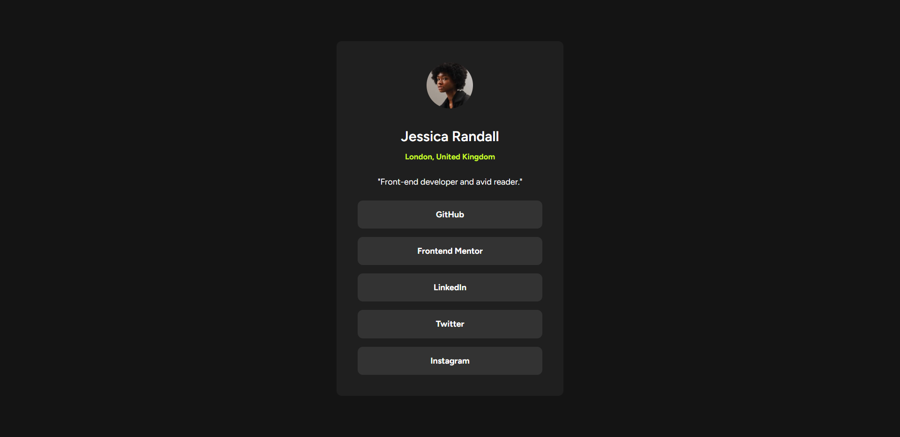

# Frontend Mentor - Social links profile solution

This is a solution to the [Social links profile challenge on Frontend Mentor](https://www.frontendmentor.io/challenges/social-links-profile-UG32l9m6dQ). Frontend Mentor challenges help you improve your coding skills by building realistic projects.

## Table of contents

- [Overview](#overview)
  - [The challenge](#the-challenge)
  - [Screenshot](#screenshot)
  - [Links](#links)
- [My process](#my-process)
  - [Built with](#built-with)
  - [What I learned](#what-i-learned)
- [Author](#author)

## Overview

### The challenge

Users should be able to:

- See hover and focus states for all interactive elements on the page

### Screenshot



### Links

- Solution URL: [Solution URL here](https://www.frontendmentor.io/solutions/social-links-profile-using-html-and-css-DWQxnC3mxB)
- Live Site URL: [Live site URL here](https://zzz-ren.github.io/Frontend-mentor-social-links-profile/)

## My process

### Built with

- Semantic HTML5 markup
- CSS custom properties
- Flexbox
- CSS Grid
- Mobile-first workflow

### What I learned

I tried to utilize rem more, which made this challenge a lot easier conbining it with dynamic vw values.

```html
<h2 class="title">HTML & CSS foundations</h2>
```

```css
.title {
  font-size: 1.5rem;
  line-height: 150%;
  letter-spacing: 0px;
  font-weight: 800;
}
```

## Author

- Website - [Dhiren Rathod](https://www.dhiren.thenetnexus.com)
- Frontend Mentor - [@zZz-ren](https://www.frontendmentor.io/profile/zZz-ren)
